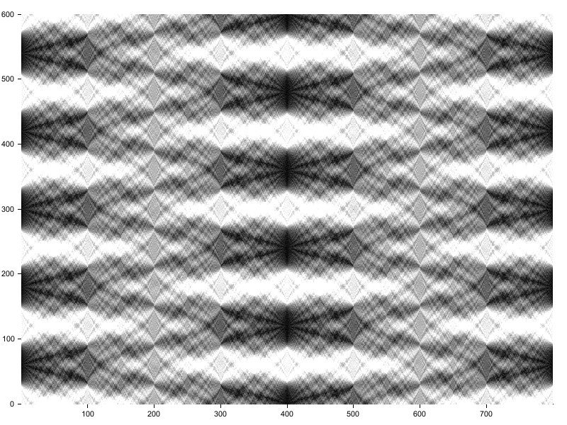

# rosetta-carpet
The [Talbot carpet]() in different languages.

# julia
```julia
using Unitful
using Unitful.DefaultSymbols
using Unitful: keV, h, c
using FFTW
FFTW.set_num_threads(Sys.CPU_THREADS)
using PyPlot

# a struct to hold the simulation info
struct PropagationInfo
    x
    y
    fx
    fy
end

# utilities
"The rectangle function."
rect(x) = one(x) .* (abs.(x) .< 0.5)

"frequencies for which the fft is calculated"
fftfreq(n) = ifftshift(-cld(n-1, 2) : fld(n-1, 2)) / n


# physics
"Transfer function for the Fresnel free propagation."
H(fx, fy, λ, z) = exp(im * 2π / λ * z) .* exp(-im * π * λ * z * (fx^2 + fy^2))
#H(fx, fy, λ, z) = exp(im * 2π / λ * z) .* exp(im * 2π/λ / z * (fx^2 + fy^2)) / (im * λ * z)

# gratings
singrating(x, y, m, L) = 0.5(1 + m * cos.(2π * x / L))
rectgrating(x, y, m, L; th = 0) = 0.5(1 + m * sign.(cos.(2π * x / L) - th))
rectgrating(pp::PropagationInfo, m, L; th = 0) = rectgrating.(
    pp.x, pp.y, m, L, th = th)
square(x, y, m, L) = m * rect(x / 2L) * rect(y / 2L)
circle(x, y, m, L) = m * rect(sqrt(x^2 + y^2) / 2L)
circle(pp::PropagationInfo, m, L) = circle.(pp.x, pp.y, m, L)
"Turns an amplitude grating into a phase one."
turn2phase(g) =  exp.(im * π / 2 * g)


function fresnelgrid(;δx = 0.1e-6, δy = δx,
        Nx = 2000, Ny = Nx, efficient = true)
    if efficient
        # FFTs are faster on arrays of lengths equal to powers of 2
        Nx = nextprod([2], Nx)
        Ny = nextprod([2], Ny)
    end

    # x are columns, y are rows
    x = δx * (collect(1:Nx) .- Nx/2)'
    y = δy * (collect(1:Ny) .- Ny/2)

    fx = (fftfreq(length(x)) ./ δx)'
    fy = fftfreq(length(y)) ./ δy

    return PropagationInfo(x, y, fx, fy)
end

tonormalspace(U) = ifft(U, (1,2))
tofourierspace(u) = fft(u, (1,2))
flatwave(pp) = ones(ComplexF64, length(pp.y), length(pp.x))

"Propagate a wavefront in the Fourier space"
propagate(U, fx, fy, λ, z) = U .* H.(fx, fy, λ, z)
propagate(U, pp::PropagationInfo, λ, z) = propagate(U, pp.fx, pp.fy, λ, z)

propagatenormal(u, pp::PropagationInfo, λ, z) = tonormalspace(
    propagate(tofourierspace(u), pp, λ, z))


pp = fresnelgrid(δx = 0.1μm, Nx = 4000, Ny = 1)
period = 10μm
g0 = rectgrating(pp, 1, period)
u1 = flatwave(pp) .* g0
λ = h * c / 46keV
u2(z) = propagatenormal(u1, pp, λ, z)


talbot_distance = 2period^2 / λ

z = reshape(collect(range(0mm, stop = 0.2talbot_distance, length = 2000)), 1, 1, :)
talbot_carpet = abs.(u2(z)).^2

plothunit = mm
plotvunit = μm

imshow(talbot_carpet[1, :, :],
    interpolation = "bicubic",
    origin="lower",
    extent=[
        ustrip(plothunit, z[1]), # left
        ustrip(plothunit, z[end]), # right
        ustrip(plotvunit, pp.x[1]), # bottom
        ustrip(plotvunit, pp.x[end]) # top
        ],
    aspect="auto")

xlabel("z position ($plothunit)")
ylabel("x position ($plotvunit)")

ylim(-20, 20)

savefig("$(dirname(dirname(@__FILE__)))/docs/carpets/julia.png")

```


# rust
```rust
use plotters::prelude::*;
use std::convert::TryFrom;
use std::f64::consts::PI;
use rustfft::num_complex::Complex;
use rustfft::num_traits::Zero;
use rustfft::FFTplanner;


fn main() -> Result<(), Box<dyn std::error::Error>> {
    let period: f64 = 10e-6;
    let lambda = 26.95e-12;

    let ny: usize = 600;
    let nz: usize = 800;

    let talbot_distance = 2. * period.powi(2) / lambda;
    let dz = talbot_distance / nz as f64;
    let dy = period * 5. / ny as f64;
    let fy = fftfreq(ny, dy);

    // The initial wavefront - rectangular grating
    let g0: Vec<Complex<f64>> = (0..ny)
        .map(|y| (y as f64) * dy)
        .map(|y| 0.5 * (1. + (2. * PI * y / period).cos().signum()))
        .map(|y| Complex::new(y, 0.))
        .collect();

    // prepare the FFT package, also for the inverse transform
    let mut planner = FFTplanner::new(false);
    let fft = planner.plan_fft(ny);
    let mut iplanner = FFTplanner::<f64>::new(true);
    let ifft = iplanner.plan_fft(ny);
    let mut input: Vec<Complex<f64>> = vec![Complex::zero(); ny];

    // where the carpet is stored
    let mut z: Vec<Vec<Complex<f64>>> = vec![vec![Complex::zero(); ny]; nz];
    z[0].copy_from_slice(&g0);

    for iz in 1..nz {
        // fft
        input.copy_from_slice(&z[0]);
        fft.process(&mut input, &mut z[iz]);

        // processing in the Fourier space
        for (v, f) in z[iz].iter_mut().zip(fy[..ny].iter()) {
            // normalization
            *v *= Complex::new(1.0 / (ny as f64), 0.0);
            // transfer function for the Fresnel free propagation
            let ddz = dz * iz as f64;
            *v *= Complex::new(0., 2.0 * PI / lambda * ddz).exp();
            *v *= Complex::new(0., -1. * PI * lambda * ddz * f.powi(2)).exp();
        }

        // inverse fft
        input.copy_from_slice(&z[iz]);
        ifft.process(&mut input, &mut z[iz]);
    }

    // plotting
    let image_path = std::env::current_exe()?
        .parent().expect("Wrong path.")
        .parent().expect("Wrong path.")
        .parent().expect("Wrong path.")
        .parent().expect("Wrong path.")
        .parent().expect("Wrong path.")
        .join("docs")
        .join("carpets")
        .join("rust.png");
    println!("{:?}", image_path);


    let nz = u32::try_from(nz)?;
    let ny = u32::try_from(ny)?;

    let root =
        BitMapBackend::new(&image_path, (nz, ny)).into_drawing_area();

    root.fill(&White)?;

    let mut chart = ChartBuilder::on(&root)
        .margin(20)
        .x_label_area_size(10)
        .y_label_area_size(10)
        .build_ranged(0..nz, 0..ny)?;

    chart
        .configure_mesh()
        .disable_x_mesh()
        .disable_y_mesh()
        .draw()?;

    let plotting_area = chart.plotting_area();

    for xplot in 0..nz {
        for yplot in 0..ny {
            plotting_area.draw_pixel(
                (xplot, yplot),
                &HSLColor(0.0, 0.0, z[xplot as usize][yplot as usize].norm()))?;
        }
    }

    Ok(())
}


fn fftfreq(n: usize, d: f64) -> Vec<f64> {
    // ref. https://docs.scipy.org/doc/numpy/reference/generated/numpy.fft.fftfreq.html
    let parity = n % 2;
    let n = n as i32;
    match parity {
        // f = [0, 1, ...,   n/2-1,     -n/2, ..., -1] / (d*n)   if n is even
        0 => (0..n/2).chain(-n/2..0),
        // f = [0, 1, ..., (n-1)/2, -(n-1)/2, ..., -1] / (d*n)   if n is odd
        1 => (0..(n-1)/2+1).chain(-(n-1)/2..0),
        _ => panic!("i32 % 2 was neither 0 nor 1!")
    }
        .map(|f| f as f64 / (d * n as f64))
        .collect()
}

```


